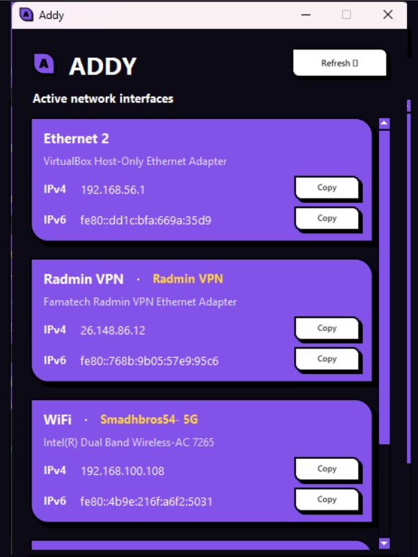

#  Addy

A beautiful, ultra-lightweight cross-platform system tray utility that displays local network interface names, connection details, and IP addresses with instant, one-click clipboard copying.

***

<p align="center">
  
  
  
  
  
</p>

---

## 🎨 Preview

<p align="center">
  
  <br>
  <em>Addy's clean, native system tray window (replace with actual screenshot once run).</em>
</p>

## ✨ Features

- 🚀 **Instant Open**: Window launches instantly from the tray using smart background data refresh.
- 🔗 **Detailed Connectivity**: Shows what your adapter is connected to (e.g., active WiFi SSIDs, network names) rather than generic names.
- 📋 **One-Click Copy**: Clicking any IPv4 or IPv6 address copies it directly to your clipboard with a visual confirmation indicator.
- 🔄 **Smart Refresh**: Automatically checks network status on demand, or on a quiet background thread.
- 🔋 **Zero Idle Footprint**: Uses close to 0% CPU and minimal RAM when minimized, making it perfect to keep running constantly in the background.
- 📦 **No Python Required**: Automatically packaged into standalone executables (`.exe`, `.app`, `.elf`) for every platform via GitHub Actions.

---

## 📥 Installation

### 1. Download Pre-built Binaries (Recommended)
You don't need Python to run Addy. Go to the [Releases](../../releases) tab and download the standalone executable for your operating system:
* **Windows**: `addy-windows-amd64.exe`
* **macOS**: `addy-macos-arm64` (Apple Silicon)
* **Linux**: `addy-linux-amd64`

### 2. Running from Source
To run Addy with your own Python environment:

1. **Clone the repository:**
   ```bash
   git clone https://github.com/Llewellyn500/addy.git
   cd addy
   ```
2. **Install Python dependencies:**
   ```bash
   pip install -r requirements.txt
   ```
3. **Run the app:**
   ```bash
   python addy.py
   ```

---

## ⚙️ Platform-Specific Requirements (Running from Source)

### 🪟 Windows
* Works out of the box with standard Python installations.

### 🍎 macOS
* Requires standard Python 3.10+.
* On first run of the compiled binary, macOS Gatekeeper may ask for permissions or require you to allow the app in **System Settings > Privacy & Security**.

### 🐧 Linux
* You must install `tkinter` as it is typically not bundled with Linux Python builds:
  * **Ubuntu/Debian**: `sudo apt install python3-tk`
  * **Fedora/RHEL**: `sudo dnf install python3-tkinter`
  * **Arch Linux**: `sudo pacman -S tk`
* System tray (`pystray`) support requires an appindicator library. Under modern desktop environments (GNOME, KDE), ensure you have:
  * **Ubuntu/Debian**: `sudo apt install libayatana-appindicator3-1 gir1.2-ayatanaappindicator3-0.1`

---

## 🤝 Contributing

Contributions make the open-source community an amazing place to learn, inspire, and create. Any contributions you make are **greatly appreciated**.

1. Fork the Project
2. Create your Feature Branch (`git checkout -b feature/AmazingFeature`)
3. Commit your Changes (`git commit -m 'Add some AmazingFeature'`)
4. Push to the Branch (`git push origin feature/AmazingFeature`)
5. Open a Pull Request

Please read [CONTRIBUTING.md](file:///D:/01_DEV/03_CODE/ip-show/CONTRIBUTING.md) for details on our code of conduct, development setup, and coding standards.

---

## 📄 License

Distributed under the MIT License. See [LICENSE](file:///D:/01_DEV/03_CODE/ip-show/LICENSE) for more information.
